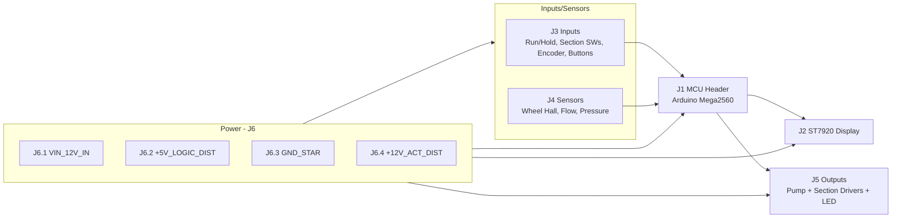
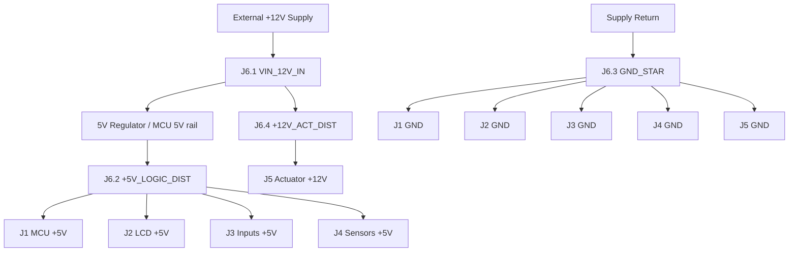

# WIRING_HARNESS.md

Engineering-grade harness definition derived from board pin headers and hardware policy.

## Scope and assumptions

- **Primary fabrication target:** Arduino Mega 2560 (this is the only profile with fully allocated UI inputs, encoder, and buttons).  
- **Display:** ST7920 128x64 in hardware SPI mode.  
- **Sensors:** Wheel sensor is treated as a Hall pulse input; flow sensor is pulse output (YF-S201C-class).  
- **Output stage:** Pump and section outputs must drive external transistor/relay stages (not raw loads from MCU pins).  
- **Uno/Nano variants are supported in firmware**, but several UI lines are
  unassigned (`0xFF`) and are therefore not fabricable as a full operator
  harness without a separate pin policy.  

## 1) Pin Table (Mega2560 build)

| Signal | MCU Pin | Dir | Module | Notes |
| --- | --- | --- | --- | --- |
| WHEEL_SIG | D18 | IN | Wheel/Hall sensor | External interrupt-capable pin |
| FLOW_SIG | D19 | IN | Flow sensor | External interrupt-capable pin |
| PUMP_PWM | D44 (PWM) | OUT | Pump driver | PWM output to external driver |
| SECTION_1_OUT | D22 | OUT | Section relay/driver 1 | Digital output |
| SECTION_2_OUT | D23 | OUT | Section relay/driver 2 | Digital output |
| SECTION_3_OUT | D24 | OUT | Section relay/driver 3 | Digital output |
| SECTION_1_LED | D25 | OUT | Indicator LED | Digital output |
| RUN_HOLD_SW | D26 | IN | Run/Hold switch | Input pull-up expected |
| SECTION_SW_1 | D27 | IN | Section switch 1 | Input pull-up expected |
| SECTION_SW_2 | D28 | IN | Section switch 2 | Input pull-up expected |
| SECTION_SW_3 | D29 | IN | Section switch 3 | Input pull-up expected |
| ENC_A | D30 | IN | Rotary encoder | Input pull-up expected |
| ENC_B | D31 | IN | Rotary encoder | Input pull-up expected |
| ENC_SW | D32 | IN | Rotary encoder push | Input pull-up expected |
| BTN_UP | D33 | IN | Operator button | Input pull-up expected |
| BTN_DOWN | D34 | IN | Operator button | Input pull-up expected |
| BTN_CAL | D35 | IN | Operator button | Input pull-up expected |
| BTN_SELECT | D36 | IN | Operator button | Input pull-up expected |
| BTN_AUTO_MAN | D37 | IN | Operator button | Input pull-up expected |
| PRESSURE_AIN | A8 | IN (Analog) | Pressure sensor (optional) | Feature-gated optional telemetry input |
| LCD_SCK | D52 (SPI SCK) | OUT | ST7920 display | SPI clock |
| LCD_MOSI | D51 (SPI MOSI) | OUT | ST7920 display | SPI data |
| LCD_CS | D53 (SPI SS/CS) | OUT | ST7920 display | Chip select |
| LCD_RST | D49 | OUT | ST7920 display | Reset line |

## 2) Connector Table

### Connector naming

- **J1** MCU main header breakout
- **J2** Display (ST7920)
- **J3** Inputs (switches/buttons/encoder)
- **J4** Sensors
- **J5** Outputs (pump/sections/indicator)
- **J6** Power input/distribution

### Connector pin definition

| Connector | Pin | Signal | Destination | Notes |
| --- | --- | --- | --- | --- |
| J1 | 1 | +5V_LOGIC | J6.2 | MCU 5V rail |
| J1 | 2 | GND | J6.3 | Common return |
| J1 | 3 | D18_WHEEL | J4.3 | Wheel sensor signal |
| J1 | 4 | D19_FLOW | J4.6 | Flow sensor signal |
| J1 | 5 | D44_PUMP_PWM | J5.2 | Pump driver PWM input |
| J1 | 6 | D22_SEC1 | J5.3 | Section 1 driver input |
| J1 | 7 | D23_SEC2 | J5.4 | Section 2 driver input |
| J1 | 8 | D24_SEC3 | J5.5 | Section 3 driver input |
| J1 | 9 | D25_SEC1_LED | J5.6 | LED anode path via resistor |
| J1 | 10 | D26_RUN_HOLD | J3.2 | Run/Hold switch signal |
| J1 | 11 | D27_SECTION_SW1 | J3.3 | Section switch 1 |
| J1 | 12 | D28_SECTION_SW2 | J3.4 | Section switch 2 |
| J1 | 13 | D29_SECTION_SW3 | J3.5 | Section switch 3 |
| J1 | 14 | D30_ENC_A | J3.6 | Encoder A |
| J1 | 15 | D31_ENC_B | J3.7 | Encoder B |
| J1 | 16 | D32_ENC_SW | J3.8 | Encoder switch |
| J1 | 17 | D33_BTN_UP | J3.9 | Button UP |
| J1 | 18 | D34_BTN_DOWN | J3.10 | Button DOWN |
| J1 | 19 | D35_BTN_CAL | J3.11 | Button CAL |
| J1 | 20 | D36_BTN_SELECT | J3.12 | Button SELECT |
| J1 | 21 | D37_BTN_AUTO_MAN | J3.13 | Button AUTO/MANUAL |
| J1 | 22 | A8_PRESSURE | J4.9 | Optional pressure analog input |
| J1 | 23 | D52_LCD_SCK | J2.3 | ST7920 SCK |
| J1 | 24 | D51_LCD_MOSI | J2.4 | ST7920 MOSI |
| J1 | 25 | D53_LCD_CS | J2.5 | ST7920 CS |
| J1 | 26 | D49_LCD_RST | J2.6 | ST7920 RST |
| J2 | 1 | +5V_LCD | J6.2 | LCD power |
| J2 | 2 | GND_LCD | J6.3 | LCD return |
| J2 | 3 | LCD_SCK | J1.23 | ST7920 serial clock |
| J2 | 4 | LCD_MOSI | J1.24 | ST7920 serial data |
| J2 | 5 | LCD_CS | J1.25 | ST7920 chip select |
| J2 | 6 | LCD_RST | J1.26 | ST7920 reset |
| J2 | 7 | LCD_PSB | J6.3 | Must be tied LOW for SPI mode |
| J3 | 1 | +5V_INPUTS | J6.2 | Pull-up/reference rail |
| J3 | 2 | RUN_HOLD_SW | J1.10 | Switch to GND when active |
| J3 | 3 | SECTION_SW_1 | J1.11 | Switch to GND when active |
| J3 | 4 | SECTION_SW_2 | J1.12 | Switch to GND when active |
| J3 | 5 | SECTION_SW_3 | J1.13 | Switch to GND when active |
| J3 | 6 | ENC_A | J1.14 | Encoder channel A |
| J3 | 7 | ENC_B | J1.15 | Encoder channel B |
| J3 | 8 | ENC_SW | J1.16 | Encoder push switch |
| J3 | 9 | BTN_UP | J1.17 | Button to GND when active |
| J3 | 10 | BTN_DOWN | J1.18 | Button to GND when active |
| J3 | 11 | BTN_CAL | J1.19 | Button to GND when active |
| J3 | 12 | BTN_SELECT | J1.20 | Button to GND when active |
| J3 | 13 | BTN_AUTO_MAN | J1.21 | Button to GND when active |
| J3 | 14 | GND_INPUTS | J6.3 | Input return/common |
| J4 | 1 | +5V_SENSOR | J6.2 | Sensor supply |
| J4 | 2 | GND_SENSOR | J6.3 | Sensor return |
| J4 | 3 | WHEEL_SIG | J1.3 | Wheel Hall pulse |
| J4 | 4 | +5V_FLOW | J6.2 | Flow sensor supply |
| J4 | 5 | GND_FLOW | J6.3 | Flow sensor return |
| J4 | 6 | FLOW_SIG | J1.4 | Flow pulse signal |
| J4 | 7 | +5V_PRESSURE | J6.2 | Optional pressure supply |
| J4 | 8 | GND_PRESSURE | J6.3 | Optional pressure return |
| J4 | 9 | PRESSURE_AOUT | J1.22 | Optional 0-5V analog |
| J5 | 1 | +12V_ACT | J6.4 | Actuator rail |
| J5 | 2 | PUMP_PWM_CMD | J1.5 | Logic command to pump driver |
| J5 | 3 | SEC1_CMD | J1.6 | Logic command to section 1 driver |
| J5 | 4 | SEC2_CMD | J1.7 | Logic command to section 2 driver |
| J5 | 5 | SEC3_CMD | J1.8 | Logic command to section 3 driver |
| J5 | 6 | SEC1_LED_CMD | J1.9 | LED command line |
| J5 | 7 | GND_ACT | J6.3 | Driver logic/power return |
| J6 | 1 | VIN_12V_IN | External supply +12V | Main incoming power |
| J6 | 2 | +5V_LOGIC_DIST | J1/J2/J3/J4 | From regulator (onboard or external buck) |
| J6 | 3 | GND_STAR | All connector grounds | Common ground star point |
| J6 | 4 | +12V_ACT_DIST | J5.1 | Actuator distribution |

## 3) Wire Table (harness mapping)

Wire ID convention used:

- **W-001..W-099** = power/ground
- **W-100..W-199** = operator inputs
- **W-200..W-299** = sensors
- **W-300..W-399** = outputs/drivers
- **W-400..W-499** = display SPI

| Wire ID | From | To | Signal | Gauge | Notes |
| --- | --- | --- | --- | --- | --- |
| W-001 | J6.2 | J1.1 | +5V_LOGIC | 22 AWG | MCU 5V rail |
| W-002 | J6.3 | J1.2 | GND | 22 AWG | MCU ground |
| W-003 | J6.2 | J2.1 | +5V_LCD | 24 AWG | LCD supply |
| W-004 | J6.3 | J2.2 | GND_LCD | 24 AWG | LCD return |
| W-005 | J6.2 | J3.1 | +5V_INPUTS | 24 AWG | Inputs rail |
| W-006 | J6.3 | J3.14 | GND_INPUTS | 24 AWG | Inputs return |
| W-007 | J6.2 | J4.1 | +5V_SENSOR | 24 AWG | Sensor rail |
| W-008 | J6.3 | J4.2 | GND_SENSOR | 24 AWG | Sensor return |
| W-009 | J6.4 | J5.1 | +12V_ACT | 18 AWG | Actuator feed |
| W-010 | J6.3 | J5.7 | GND_ACT | 18 AWG | Actuator/driver return |
| W-011 | J6.3 | J2.7 | LCD_PSB_GND | 24 AWG | Force ST7920 serial mode |
| W-012 | J6.2 | J4.4 | +5V_FLOW | 24 AWG | Flow sensor VCC |
| W-013 | J6.3 | J4.5 | GND_FLOW | 24 AWG | Flow sensor GND |
| W-014 | J6.2 | J4.7 | +5V_PRESSURE | 24 AWG | Optional pressure VCC |
| W-015 | J6.3 | J4.8 | GND_PRESSURE | 24 AWG | Optional pressure GND |
| W-101 | J1.10 | J3.2 | RUN_HOLD_SW | 24 AWG | Active-low switch line |
| W-102 | J1.11 | J3.3 | SECTION_SW_1 | 24 AWG | Active-low switch line |
| W-103 | J1.12 | J3.4 | SECTION_SW_2 | 24 AWG | Active-low switch line |
| W-104 | J1.13 | J3.5 | SECTION_SW_3 | 24 AWG | Active-low switch line |
| W-105 | J1.14 | J3.6 | ENC_A | 24 AWG | Encoder phase A |
| W-106 | J1.15 | J3.7 | ENC_B | 24 AWG | Encoder phase B |
| W-107 | J1.16 | J3.8 | ENC_SW | 24 AWG | Encoder push |
| W-108 | J1.17 | J3.9 | BTN_UP | 24 AWG | Active-low button |
| W-109 | J1.18 | J3.10 | BTN_DOWN | 24 AWG | Active-low button |
| W-110 | J1.19 | J3.11 | BTN_CAL | 24 AWG | Active-low button |
| W-111 | J1.20 | J3.12 | BTN_SELECT | 24 AWG | Active-low button |
| W-112 | J1.21 | J3.13 | BTN_AUTO_MAN | 24 AWG | Active-low button |
| W-201 | J4.3 | J1.3 | WHEEL_SIG | 24 AWG | Hall pulse to MCU D18 |
| W-202 | J4.6 | J1.4 | FLOW_SIG | 24 AWG | Flow pulse to MCU D19 |
| W-203 | J4.9 | J1.22 | PRESSURE_AOUT | 24 AWG | Optional analog to A8 |
| W-301 | J1.5 | J5.2 | PUMP_PWM_CMD | 22 AWG | PWM command to pump driver input |
| W-302 | J1.6 | J5.3 | SEC1_CMD | 22 AWG | Section 1 command |
| W-303 | J1.7 | J5.4 | SEC2_CMD | 22 AWG | Section 2 command |
| W-304 | J1.8 | J5.5 | SEC3_CMD | 22 AWG | Section 3 command |
| W-305 | J1.9 | J5.6 | SEC1_LED_CMD | 24 AWG | LED control via resistor |
| W-401 | J1.23 | J2.3 | LCD_SCK | 24 AWG | SPI SCK |
| W-402 | J1.24 | J2.4 | LCD_MOSI | 24 AWG | SPI MOSI |
| W-403 | J1.25 | J2.5 | LCD_CS | 24 AWG | SPI CS |
| W-404 | J1.26 | J2.6 | LCD_RST | 24 AWG | Display reset |

## 4) Mermaid System Diagram

## 5) Mermaid Pin-Level Diagram (with wire IDs)

```mermaid
flowchart LR
  J6_2[J6.2 +5V] -- W-001 --> J1_1[J1.1 +5V_LOGIC]
  J6_3[J6.3 GND] -- W-002 --> J1_2[J1.2 GND]

  J1_10[J1.10 D26] -- W-101: RUN_HOLD_SW --> J3_2[J3.2 RUN_HOLD_SW]
  J1_11[J1.11 D27] -- W-102: SECTION_SW_1 --> J3_3[J3.3 SECTION_SW_1]
  J1_12[J1.12 D28] -- W-103: SECTION_SW_2 --> J3_4[J3.4 SECTION_SW_2]
  J1_13[J1.13 D29] -- W-104: SECTION_SW_3 --> J3_5[J3.5 SECTION_SW_3]
  J1_14[J1.14 D30] -- W-105: ENC_A --> J3_6[J3.6 ENC_A]
  J1_15[J1.15 D31] -- W-106: ENC_B --> J3_7[J3.7 ENC_B]
  J1_16[J1.16 D32] -- W-107: ENC_SW --> J3_8[J3.8 ENC_SW]
  J1_17[J1.17 D33] -- W-108: BTN_UP --> J3_9[J3.9 BTN_UP]
  J1_18[J1.18 D34] -- W-109: BTN_DOWN --> J3_10[J3.10 BTN_DOWN]
  J1_19[J1.19 D35] -- W-110: BTN_CAL --> J3_11[J3.11 BTN_CAL]
  J1_20[J1.20 D36] -- W-111: BTN_SELECT --> J3_12[J3.12 BTN_SELECT]
  J1_21[J1.21 D37] -- W-112: BTN_AUTO_MAN --> J3_13[J3.13 BTN_AUTO_MAN]

  J4_3[J4.3 WHEEL_SIG] -- W-201: WHEEL_SIG --> J1_3[J1.3 D18]
  J4_6[J4.6 FLOW_SIG] -- W-202: FLOW_SIG --> J1_4[J1.4 D19]
  J4_9[J4.9 PRESSURE_AOUT] -- W-203: PRESSURE_AOUT --> J1_22[J1.22 A8]

  J1_5[J1.5 D44] -- W-301: PUMP_PWM_CMD --> J5_2[J5.2 PUMP_PWM_CMD]
  J1_6[J1.6 D22] -- W-302: SEC1_CMD --> J5_3[J5.3 SEC1_CMD]
  J1_7[J1.7 D23] -- W-303: SEC2_CMD --> J5_4[J5.4 SEC2_CMD]
  J1_8[J1.8 D24] -- W-304: SEC3_CMD --> J5_5[J5.5 SEC3_CMD]
  J1_9[J1.9 D25] -- W-305: SEC1_LED_CMD --> J5_6[J5.6 SEC1_LED_CMD]

  J1_23[J1.23 D52] -- W-401: LCD_SCK --> J2_3[J2.3 LCD_SCK]
  J1_24[J1.24 D51] -- W-402: LCD_MOSI --> J2_4[J2.4 LCD_MOSI]
  J1_25[J1.25 D53] -- W-403: LCD_CS --> J2_5[J2.5 LCD_CS]
  J1_26[J1.26 D49] -- W-404: LCD_RST --> J2_6[J2.6 LCD_RST]

  J6_2 -- W-003 --> J2_1[J2.1 +5V_LCD]
  J6_3 -- W-004 --> J2_2[J2.2 GND_LCD]
  J6_3 -- W-011 --> J2_7[J2.7 LCD_PSB]

  J6_2 -- W-005 --> J3_1[J3.1 +5V_INPUTS]
  J6_3 -- W-006 --> J3_14[J3.14 GND_INPUTS]

  J6_2 -- W-007 --> J4_1[J4.1 +5V_SENSOR]
  J6_3 -- W-008 --> J4_2[J4.2 GND_SENSOR]
  J6_2 -- W-012 --> J4_4[J4.4 +5V_FLOW]
  J6_3 -- W-013 --> J4_5[J4.5 GND_FLOW]
  J6_2 -- W-014 --> J4_7[J4.7 +5V_PRESSURE]
  J6_3 -- W-015 --> J4_8[J4.8 GND_PRESSURE]

  J6_4[J6.4 +12V_ACT] -- W-009 --> J5_1[J5.1 +12V_ACT]
  J6_3 -- W-010 --> J5_7[J5.7 GND_ACT]
```

## 6) Mermaid Power Diagram

## 7) Wiring Table (final authority)

| Wire ID | From (Connector.Pin) | To (Connector.Pin) | Signal | Notes |
| --- | --- | --- | --- | --- |
| W-001 | J6.2 | J1.1 | +5V_LOGIC | MCU logic rail |
| W-002 | J6.3 | J1.2 | GND | MCU return |
| W-003 | J6.2 | J2.1 | +5V_LCD | Display power |
| W-004 | J6.3 | J2.2 | GND_LCD | Display return |
| W-005 | J6.2 | J3.1 | +5V_INPUTS | Input rail |
| W-006 | J6.3 | J3.14 | GND_INPUTS | Input return |
| W-007 | J6.2 | J4.1 | +5V_SENSOR | Sensor rail |
| W-008 | J6.3 | J4.2 | GND_SENSOR | Sensor return |
| W-009 | J6.4 | J5.1 | +12V_ACT | Actuator feed |
| W-010 | J6.3 | J5.7 | GND_ACT | Driver return |
| W-011 | J6.3 | J2.7 | LCD_PSB_GND | Required SPI mode strap |
| W-012 | J6.2 | J4.4 | +5V_FLOW | Flow sensor VCC |
| W-013 | J6.3 | J4.5 | GND_FLOW | Flow sensor GND |
| W-014 | J6.2 | J4.7 | +5V_PRESSURE | Optional pressure VCC |
| W-015 | J6.3 | J4.8 | GND_PRESSURE | Optional pressure GND |
| W-101 | J1.10 | J3.2 | RUN_HOLD_SW | Active-low input |
| W-102 | J1.11 | J3.3 | SECTION_SW_1 | Active-low input |
| W-103 | J1.12 | J3.4 | SECTION_SW_2 | Active-low input |
| W-104 | J1.13 | J3.5 | SECTION_SW_3 | Active-low input |
| W-105 | J1.14 | J3.6 | ENC_A | Encoder A |
| W-106 | J1.15 | J3.7 | ENC_B | Encoder B |
| W-107 | J1.16 | J3.8 | ENC_SW | Encoder switch |
| W-108 | J1.17 | J3.9 | BTN_UP | Button input |
| W-109 | J1.18 | J3.10 | BTN_DOWN | Button input |
| W-110 | J1.19 | J3.11 | BTN_CAL | Button input |
| W-111 | J1.20 | J3.12 | BTN_SELECT | Button input |
| W-112 | J1.21 | J3.13 | BTN_AUTO_MAN | Button input |
| W-201 | J4.3 | J1.3 | WHEEL_SIG | Hall pulse |
| W-202 | J4.6 | J1.4 | FLOW_SIG | Flow pulse |
| W-203 | J4.9 | J1.22 | PRESSURE_AOUT | Optional analog telemetry |
| W-301 | J1.5 | J5.2 | PUMP_PWM_CMD | PWM to pump driver |
| W-302 | J1.6 | J5.3 | SEC1_CMD | Section 1 command |
| W-303 | J1.7 | J5.4 | SEC2_CMD | Section 2 command |
| W-304 | J1.8 | J5.5 | SEC3_CMD | Section 3 command |
| W-305 | J1.9 | J5.6 | SEC1_LED_CMD | Indicator command |
| W-401 | J1.23 | J2.3 | LCD_SCK | SPI clock |
| W-402 | J1.24 | J2.4 | LCD_MOSI | SPI data |
| W-403 | J1.25 | J2.5 | LCD_CS | SPI chip select |
| W-404 | J1.26 | J2.6 | LCD_RST | Display reset |

## 8) Validation

### A) Pin conflicts

- Mega2560 mapping has no duplicate assigned role pins and excludes reserved LCD pins (52/51/53/49) by static policy guards.
- Uno/Nano are marked supported, but **full UI equivalence is not present**:
  - Uno assigns encoder and buttons to `0xFF` (unassigned).
  - Nano assigns encoder A/B only, with encoder switch/buttons still unassigned.

### B) Electrical risks

- **HIGH:** Switch/button/encoder lines rely on pull-ups; if firmware pinMode setup is changed, inputs may float.
- **HIGH:** Pump/section loads must not be directly driven from MCU pins; external drivers are mandatory.
- **MEDIUM:** No explicit EMI conditioning/shielding is documented for pulse sensors (flow/hall); long harness runs may induce noise.
- **LOW:** Optional pressure sensor wiring can be left open; verify A8 handling in firmware to avoid noisy readings.

### C) Interface validation

- SPI (ST7920): SCK=D52, MOSI=D51, CS=D53, RST=D49 (valid for Mega hardware SPI mode).
- I2C: not used in this harness definition.

## 9) Issues Table

| Severity | Issue | Location | Fix |
| --- | --- | --- | --- |
| HIGH | Uno profile cannot support full operator input set (encoder/buttons unassigned) | `include/pins_uno.h` | Allocate dedicated UI pins or constrain feature set for Uno builds |
| MEDIUM | Nano profile partially allocates encoder (A/B only) while other UI controls unassigned | `include/pins_nano.h` | Add complete UI pin policy or mark as reduced-input variant in docs |
| HIGH | Potential direct-load misuse if harness is interpreted as power-capable outputs | J5 outputs | Specify transistor/relay driver board with flyback protection in BOM/wiring notes |
| MEDIUM | Pull-up dependency not explicitly shown in harness hardware BOM | J3 inputs | Add resistor network or enforce `INPUT_PULLUP` behavior validation during bring-up |
